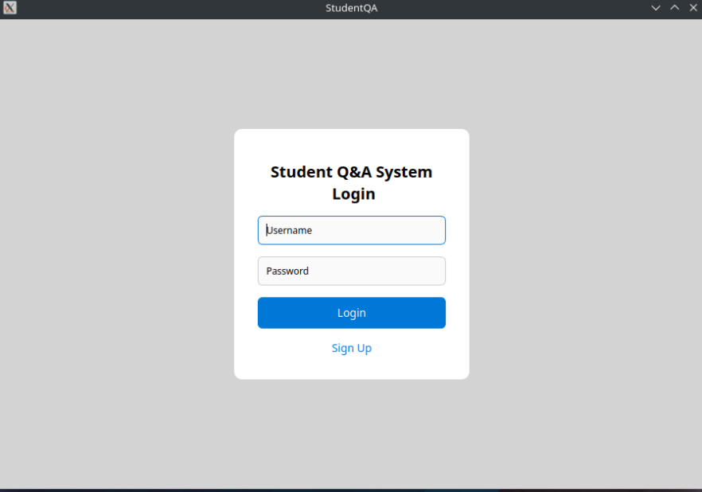
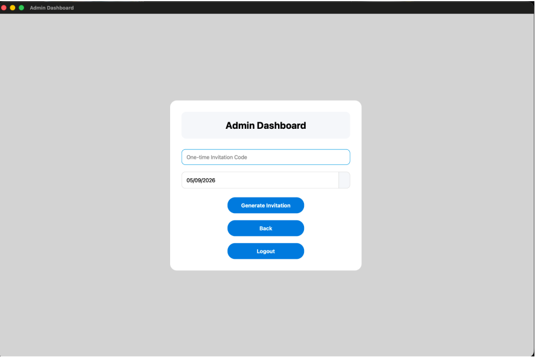
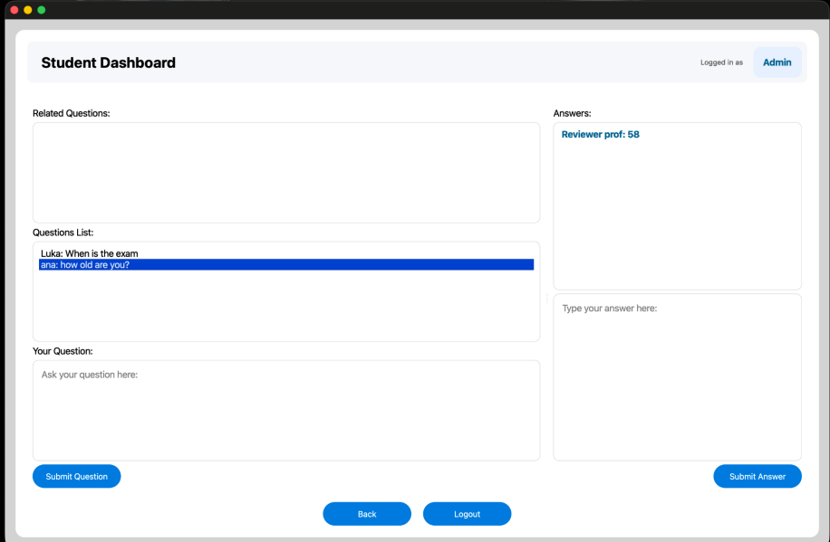
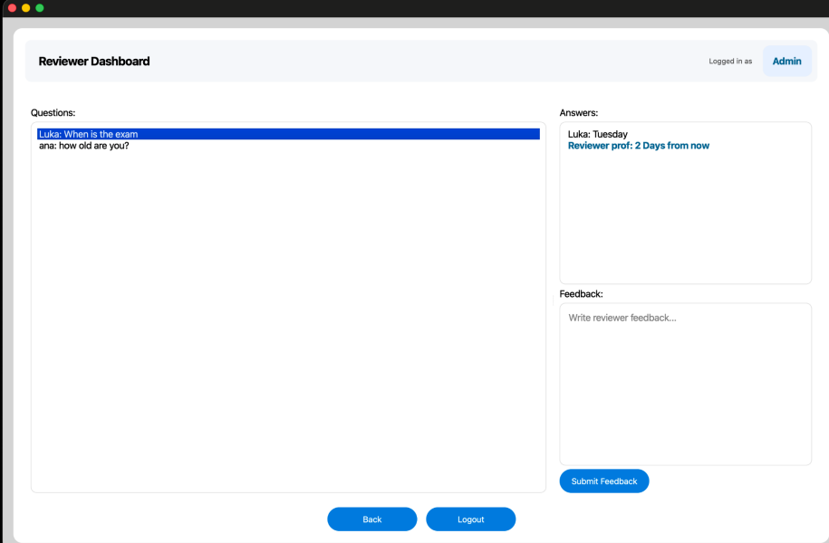

# Student Q&A System

A desktop discussion board for classes, built in C++ with the Qt framework and
backed by Google Firebase. Students post questions and answers, reviewers give
feedback, and admins control who can register.

## Screenshots

| Login | Admin Dashboard |
|---|---|
|  |  |

| Student Dashboard | Reviewer Dashboard |
|---|---|
|  |  |

## Features

- **Role-based dashboards** for students, reviewers, and administrators
- **Invitation-code registration:** admins generate one-time codes with
  expiration dates; new users need a valid code to sign up
- **First-user setup:** the first account created becomes the admin
- **Questions and answers:** students post and answer questions; reviewer
  answers are highlighted
- **Reviewer feedback** on student answers
- **Online backend:** posts sync through Firebase, with live polling for
  new activity

## Tech Stack

C++, Qt 6.10.2, Google Firebase

## Building

Requires Qt 6.10.2. Open the project in CLion or Qt Creator.

## Team

Built by a team of 4 for ASU CSE 360 Spring 2026.

**My contributions (Luka Powers):** invitation-code sign-up system, user
storage and role logic, Firebase backend integration and live polling, and
UI and quality-of-life fixes across the dashboards.
